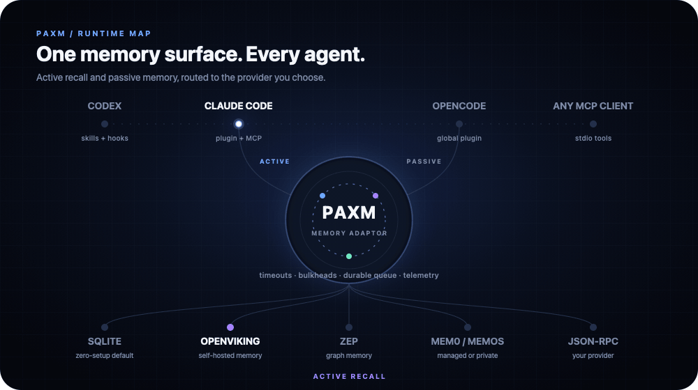
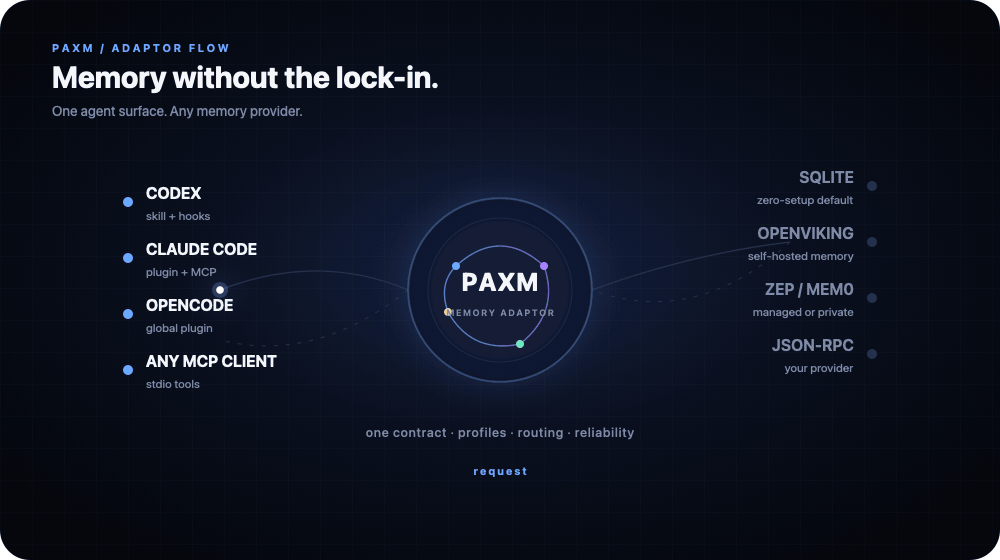
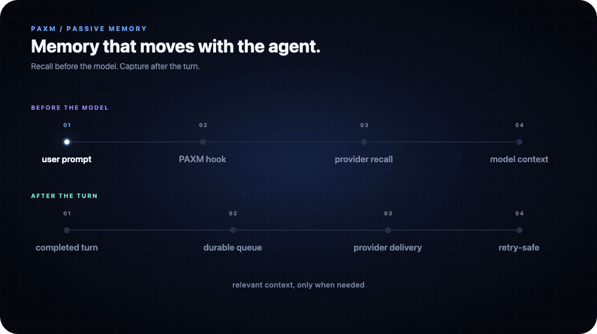

<div align="center">

# PAXM

### One memory adaptor for every AI agent.

[](https://github.com/pax-beehive/paxm/actions/workflows/ci.yml)
[](https://github.com/pax-beehive/paxm/releases/latest)
[](go.mod)
[](https://github.com/pax-beehive/paxm/releases/latest)

Connect Codex, Claude Code, OpenCode, Pi, and MCP clients to the memory system
you choose through one active and passive memory surface. Use the default
SQLite provider, connect Zep, Mem0, MemOS, or OpenViking, or bring a private
provider through JSON-RPC.

[Install](#quick-start) · [SQLite quality](#sqlite-quality-preview) · [How it works](#how-it-works) · [Providers](#agents-and-providers) · [Docs](#documentation)

</div>



## Why paxm

Memory engines often leave agent integration to the user. Each agent needs its
own SDK wiring, MCP instructions, lifecycle hooks, and failure handling. Every
new agent or provider multiplies that work.

`paxm` makes that integration reusable. Agents get one memory surface,
providers implement one adapter contract, and users keep control of
credentials, routing, hooks, and data location.

`paxm` is a memory adaptor, not another local memory service. It standardizes
how agents recall and write memory while leaving storage, extraction, search,
and hosting to the selected provider. SQLite is included as a convenient,
zero-setup default so paxm works immediately; it is one provider behind the
same routing contract, not the product boundary.

```text
AI agents  ->  CLI / MCP / skills / hooks  ->  paxm  ->  any memory provider
```

## What you get

- **Active memory** through CLI commands, MCP tools, and an agent skill.
- **Passive memory** through lifecycle hooks that recall context and capture
  durable writes without relying on the model to call a tool.
- **Provider independence** through a common search/write contract and
  multi-provider routing.
- **A zero-setup default** with SQLite, requiring no account or external model
  for memory ingestion or retrieval, without coupling agents to SQLite.
- **Failure isolation** with per-provider timeouts, an overall passive-recall
  budget, bulkheads, and partial-result fallback.
- **Durable passive writes** through a local queue with retry, deduplication,
  and crash-safe state.
- **Operational visibility** through local event logs, latency histograms,
  provider errors, timeout counts, and `paxm history`.

## SQLite quality preview

SQLite is paxm's default provider, not its product identity. It gives new users
a complete memory path before they choose or deploy a dedicated memory system.
The implementation combines FTS5 and BM25 retrieval with turn-level memories
and deterministic, query-focused excerpts for unusually long results.

It performs memory ingestion and retrieval without calling an external LLM or
embedding service. The answering agent still uses its configured model; the
zero-model-cost claim applies to the memory layer.

In an initial 30-question LoCoMo agent evaluation, SQLite turn memory answered
13 questions successfully, compared with 11 for Mem0 product-default.

| Memory arm | Successful answers | Mean token F1 | External models in memory layer |
| --- | ---: | ---: | --- |
| paxm SQLite turn memory | 13 / 30 | 0.4211 | None |
| Mem0 product-default | 11 / 30 | 0.3811 | GPT-5 mini + OpenAI embeddings |

This is an exploratory result, not an official LoCoMo score or proof that
SQLite broadly outperforms Mem0. It covers one balanced conversation with
OpenCode and DeepSeek V4 Flash, using deterministic token F1.

The result supports a narrower claim: local SQLite memory can deliver
competitive agent recall quality without external model cost. See the
[LoCoMo methodology and limitations](evals/locomo/README.md).

For graph memory, semantic extraction, managed infrastructure, or a different
retrieval strategy, connect Zep, Mem0, MemOS, or a custom provider without
changing the agent integrations.

## Quick start

Choose the path for the agent you use. The Codex plugin is the shortest path:

### Codex plugin

```bash
codex plugin marketplace add pax-beehive/paxm --ref paxm-memory-v0.1.4
codex plugin add paxm-memory@pax-agent-nexus
paxm setup --integration codex-plugin
```

Start a new Codex task and trust the Pax Agent neXus hooks when `/hooks` asks.
The plugin installs the latest published paxm binary, registers active-memory
skills, and owns the passive Codex hooks.

Set `PAXM_VERSION` before installation for a reproducible version or rollback.
Provider credentials remain user-managed.

### Claude Code plugin

Install the paxm CLI, then install the Claude Code plugin:

```bash
curl -fsSL https://github.com/pax-beehive/paxm/releases/latest/download/install.sh | bash
claude plugin marketplace add pax-beehive/paxm
claude plugin install paxm-claude@pax-memory
paxm setup --integration claude-plugin
```

The Claude plugin includes active-memory skills, the paxm MCP server, and five
lifecycle hooks: `SessionStart`, `UserPromptSubmit`, `PostToolUse`,
`PostToolUseFailure`, and `Stop`.

### OpenCode, Pi, CLI, or MCP

Install the latest release and run interactive setup. The default SQLite
provider makes the adaptor usable without first creating an account or API
key.

```bash
curl -fsSL https://github.com/pax-beehive/paxm/releases/latest/download/install.sh | bash
paxm setup
paxm config doctor
```

`paxm setup` is where the user chooses providers and passive agent
integrations. Use up/down to move, space to toggle, and enter to confirm.
Selected agents are configured one at a time.

Active recall skills remain user-installed. SQLite works without an API key;
remote providers such as Zep, Mem0, MemOS, and OpenViking require connection
details during setup.

SQLite health checks must be allowed to create WAL/SHM files beside the
configured database. A sandbox that can read the database but cannot write its
parent directory may report SQLite error 14.

Use an isolated writable SQLite path for sandboxed evaluations. The same
configuration may be healthy in the real agent process.

When Codex is using the bundled `paxm-memory` plugin, let the plugin own Codex's
hooks so paxm does not register a duplicate global hook:

Write and recall a memory:

```bash
paxm remember --profile ltm --text "We chose SQLite for the local memory layer"
paxm recall --query "local memory layer"
paxm history --days 7
```

Select OpenCode during setup to install a global local plugin under
`~/.config/opencode/plugins/`. Select Pi to install its passive extension. Any
MCP-compatible client can use `paxm mcp serve` without passive hooks.

## How it works

Agents reach paxm in two ways:

| Path | Entry points | Best for |
| --- | --- | --- |
| Active | CLI, MCP, skill | Deliberate recall, explicit writes, inspection |
| Passive | Agent lifecycle hooks | Prompt-time recall and automatic turn capture |

Both paths use the same runtime and provider router. Filtering, profiles,
ranking, timeouts, telemetry, and provider behavior stay consistent across
agent surfaces.

Passive writes commit to a local durable queue before provider delivery. Slow
or unavailable providers retry in the background instead of blocking the
agent.

Passive recall uses an `800ms` overall budget and `250ms` per-provider budget
by default. It returns healthy partial results and records downstream
timeouts.

### See it in motion

<details>
<summary><strong>One agent surface, any memory provider</strong></summary>

<br>

<p align="center">
  
</p>

PAXM keeps the agent-facing contract stable while profiles choose providers,
failure policy, ranking, and timeouts. SQLite is the zero-setup default, not a
required storage backend.

</details>

<details>
<summary><strong>Passive recall and durable background writes</strong></summary>

<br>

<p align="center">
  
</p>

Lifecycle hooks recall context before the model request and capture completed
turns afterward. Writes enter a durable local queue before provider delivery,
so provider latency does not block the agent.

</details>

Read the detailed [architecture](docs/architecture.md) and
[provider adapter contract](docs/provider-adapter-contract.md).

## Agents and providers

### Agent surfaces

| Agent/client | Active | Passive recall | Passive write |
| --- | :---: | :---: | :---: |
| Codex | CLI, MCP, skill | Hook | Hook |
| Claude Code | CLI, MCP, skill | Hook | Hook |
| Pi | CLI, MCP, skill | Extension | Extension |
| Any MCP client | MCP tools | — | — |

### Memory providers

| Provider | Mode | Notes |
| --- | --- | --- |
| SQLite | Default, built in | Zero-setup turn memory; no API key, LLM, or embeddings |
| Zep | Built in | User or graph scoped |
| Mem0 | Built in | Self-hosted REST API |
| Mem0 Cloud | Built in | Managed Platform API with async v3 writes/search |
| MemOS | Built in | Self-hosted product API, scoped by memory cube |
| MemOS Cloud | Built in | Managed OpenMem API with Token authentication |
| OpenViking | Built in | Self-hosted session extraction and semantic memory search |
| Custom JSON-RPC | Adapter | Bring an existing or private memory system |

Enable multiple provider instances at once. Recall and write profiles control
routes, required or best-effort behavior, ranking weights, thresholds, memory
tiers, and timeouts.

### Self-hosted OpenViking

OpenViking support connects paxm to a user-operated OpenViking server. Writes
are recorded through OpenViking sessions and committed for asynchronous memory
extraction. Recall uses semantic memory search through `/api/v1/search/find`.
The server URL and optional API key remain in the user's paxm configuration.

Run `paxm setup`, select OpenViking, and provide the self-hosted base URL and
API key. OpenViking can then participate in the same recall and write profiles
as SQLite or any other provider, with required or best-effort routing and
provider-specific timeouts.

## MCP server

Run paxm as a local stdio MCP server:

```bash
paxm mcp serve
```

```json
{
  "command": "paxm",
  "args": ["mcp", "serve"]
}
```

The server exposes four focused tools:

- `paxm_recall`
- `paxm_remember`
- `paxm_history`
- `paxm_config_doctor`

Setup, credential management, hook installation, and backfill stay outside MCP
so an agent cannot silently take ownership of user configuration.

## Agent integrations

### Codex plugin

The Codex plugin packages the paxm setup skill, active memory skill, and native
Codex hooks. It does not install provider credentials or bypass hook trust.

Use `paxm setup --integration codex-plugin` so only the plugin owns the Codex
lifecycle hooks.

### Claude Code plugin

The Claude Code plugin is a first-class integration, not a generic setup shim.
It packages skills, an MCP server, and five native lifecycle hooks.

Setup removes only legacy paxm-managed Claude hooks, preserves unrelated hooks,
and records `claude-plugin` ownership.

### Pi extension

Pi support is installed through `paxm setup`. The extension handles passive
prompt recall and buffers visible user, assistant, and tool events into one
turn-end memory while excluding thinking blocks.

### OpenCode plugin

OpenCode support is installed through `paxm setup` as a dependency-free global
plugin. The plugin uses OpenCode's `chat.message` and model-message transform
hooks for passive recall.

On `session.idle`, it reads the completed session through the official client
and writes a durable turn. It captures visible user and assistant text while
excluding reasoning and tool payloads.

The generated plugin lives at `~/.config/opencode/plugins/paxm.ts`, or below
`OPENCODE_CONFIG_DIR`/`XDG_CONFIG_HOME` when configured.

See the complete [configuration guide](docs/config.md) for generated paths,
event mappings, profile settings, and uninstall behavior.

## Reliability by default

- Hook acknowledgement waits only for the local queue transaction.
- Provider delivery is resumable and retried in the background.
- Optional provider failures do not discard healthy provider results.
- A stuck provider is contained by its timeout and single-call bulkhead.
- Write-provider routes default to a 30-second timeout; optional failures remain
  isolated while required-provider failures are returned to the caller.
- Recall provenance is stripped before passive writes to prevent memory echo.
- Exact LTM consolidation limits duplicate accumulation.
- SQLite preserves completed agent turns with explicit session, turn, and time
  boundaries.
- Telemetry stores hashes and lengths by default, not raw recall queries.

Historical imports are also resumable:

```bash
paxm backfill scan --agent codex --before 2026-07-09
paxm backfill run --agent codex --provider mem0-company --background
paxm backfill status --agent codex --provider mem0-company
```

## Performance

Benchmarks use runtime-generated temporary datasets modeled after real passive
agent workloads; no benchmark corpus is committed to the repository.

On an Apple M4 reference machine:

| Workload | Adapter latency |
| --- | ---: |
| 128 KiB SQLite write | 1.84 ms |
| 2 MiB SQLite write | 14.31 ms |
| 10-item / 1.25 MiB batch | 12.36 ms |
| Recall from 100,000 short memories | 0.54 ms |
| Recall from 10,000 x 32 KiB memories | 0.61 ms |

These numbers measure the adapter, not end-to-end agent response time. See the
datasets, commands, allocations, and machine details in
[SQLite adapter benchmarks](docs/benchmarks.md).

## Evaluation

paxm separates deterministic regression suites from paid, real-agent quality
evaluations. CI protects runtime behavior; opt-in benchmarks measure whether
memory helps an agent answer correctly.

The repository includes deterministic production-path evaluations:

```bash
go run ./cmd/paxm eval run --suite evals/baseline
go run ./cmd/paxm eval run --suite evals/conversation-write
```

- A 100-case retrieval suite reports recall@K, precision@K, MRR, false-positive
  rate, latency, and category-level results.
- A 50-case conversation-to-write suite checks admission, recall, forbidden
  fragments, metadata preservation, and adapter contract behavior.

CI runs unit tests, vet, the retrieval report, and the adapter write contract on
every push to `main` and every pull request.

The opt-in [LoCoMo agent benchmark](evals/locomo/README.md) exercises real
OpenCode sessions and production MCP or passive recall.

The [cross-agent benchmark](evals/cross-agent/README.md) tests whether one
agent's experience helps another avoid the same failure.

Paid agent evaluations are never run in ordinary CI. Their reports separate
memory-layer cost from answering-model cost and state their evidence limits.

## Documentation

| Guide | Contents |
| --- | --- |
| [Configuration](docs/config.md) | Providers, profiles, agents, hooks, telemetry |
| [Architecture](docs/architecture.md) | Runtime modules and data flow |
| [Provider contract](docs/provider-adapter-contract.md) | Implementing a memory adapter |
| [Benchmarks](docs/benchmarks.md) | Passive workload datasets and results |
| [LoCoMo evaluation](evals/locomo/README.md) | Real-agent memory quality methodology |
| [Release guide](docs/release.md) | Builds, checksums, tags, and publishing |
| [Roadmap](docs/roadmap.md) | Current product direction |

## Development

```bash
go test ./...
go vet ./...
go build -o /tmp/paxm ./cmd/paxm
/tmp/paxm --config /tmp/paxm-dev/config.yaml setup --force
```

## Releases

Releases cover macOS, Linux, and Windows on `amd64` and `arm64`. Published
archives include `SHA256SUMS`, and the installer verifies the selected archive
before replacing the binary.

See the [release guide](docs/release.md) for validation, tagging, asset, and
installer smoke-test requirements.
