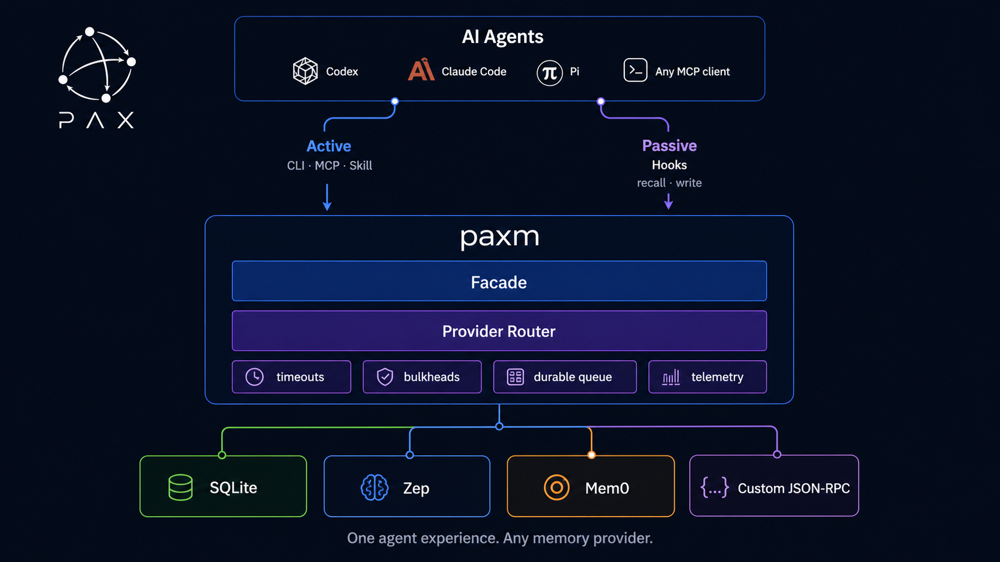

<div align="center">

# paxm

### One memory experience for every AI agent and every memory provider.

[](https://github.com/pax-beehive/paxm/actions/workflows/ci.yml)
[](https://github.com/pax-beehive/paxm/releases/latest)
[](go.mod)
[](https://github.com/pax-beehive/paxm/releases/latest)

Local-first memory infrastructure for Codex, Claude Code, OpenCode, Pi, and MCP
clients.
Use SQLite out of the box, connect Zep or Mem0, or bring any provider behind a
small JSON-RPC adapter.

[Install](#quick-start) · [How it works](#how-it-works) · [Providers](#agents-and-providers) · [Documentation](#documentation)

</div>



## Why paxm

Memory systems tend to optimize the memory engine and leave integration to
everyone else. Users must wire SDKs into each agent, or remember to call MCP
tools and skills manually. Provider authors must build a separate integration
for every agent runtime.

`paxm` removes that duplication. Agents get one consistent active and passive
memory surface. Providers implement one adapter contract. Users keep control of
credentials, routing policy, hooks, and where their data lives.

```text
AI agents  ->  CLI / MCP / skills / hooks  ->  paxm  ->  any memory provider
```

## What you get

- **Active memory** through CLI commands, MCP tools, and an agent skill.
- **Passive memory** through lifecycle hooks that recall context and capture
  durable writes without relying on the model to call a tool.
- **Provider independence** through a common search/write contract and
  multi-provider routing.
- **Local-first defaults** with SQLite and no required account or API key.
- **Failure isolation** with per-provider timeouts, an overall passive-recall
  budget, bulkheads, and partial-result fallback.
- **Durable passive writes** through a local queue with retry, deduplication,
  and crash-safe state.
- **Operational visibility** through local event logs, latency histograms,
  provider errors, timeout counts, and `paxm history`.

## What paxm is not

`paxm` is not another sophisticated memory engine or a hosted memory cloud. It
does not try to own embeddings, knowledge graphs, semantic consolidation,
reranking research, or long-term memory intelligence.

Those capabilities belong to memory providers. Paxm focuses on the integration
and runtime layer: agent entry points, lifecycle hooks, provider routing,
failure isolation, durable delivery, and telemetry.

The built-in SQLite provider is a practical local baseline, not a claim to
state-of-the-art memory quality. Use Zep, Mem0, or a custom adapter when you need
more advanced retrieval and memory behavior without rebuilding every agent
integration.

## Quick start

Choose the path for the agent you use. The Codex plugin is the shortest path:

### Codex plugin

```bash
codex plugin marketplace add pax-beehive/paxm --ref paxm-memory-v0.1.3
codex plugin add paxm-memory@pax-agent-nexus
paxm setup --integration codex-plugin
```

Start a new Codex task and trust the Pax Agent neXus hooks when `/hooks` asks.
The plugin installs its reviewed paxm binary, registers active-memory skills,
and owns the passive Codex hooks. Provider credentials remain user-managed.

### Claude Code plugin

Install the paxm CLI, then install the Claude Code plugin:

```bash
curl -fsSL https://github.com/pax-beehive/paxm/releases/latest/download/install.sh | bash
claude plugin marketplace add pax-beehive/paxm
claude plugin install paxm-claude@pax-memory
paxm setup --integration claude-plugin
```

The Claude plugin includes active-memory skills, the paxm MCP server, and five
lifecycle hooks: `SessionStart`, `UserPromptSubmit`, `PostToolUse`,
`PostToolUseFailure`, and `Stop`.

### OpenCode, Pi, CLI, or MCP

Install the latest release and run interactive setup. SQLite provides a full
local flow without an account or API key.

```bash
curl -fsSL https://github.com/pax-beehive/paxm/releases/latest/download/install.sh | bash
paxm setup
paxm config doctor
```

`paxm setup` is where the user chooses memory providers and passive agent
integrations. In a terminal, use up/down to move, space to toggle, and enter to
confirm. Selected agents are configured one at a time for passive recall and
passive writes. Active recall skills are installed separately by the user. The
SQLite provider works without an API key; remote providers such as Zep or Mem0
require the user to provide their connection details during setup.

SQLite health checks must be allowed to create WAL/SHM files beside the
configured database. A sandbox that can read the database but cannot write its
parent directory may report SQLite error 14 even though the same config is
healthy in the real agent process. Use an isolated writable SQLite path for
sandboxed evaluations.

When Codex is using the bundled `paxm-memory` plugin, let the plugin own Codex's
hooks so paxm does not register a duplicate global hook:

Write and recall a memory:

```bash
paxm remember --profile ltm --text "We chose SQLite for the local memory layer"
paxm recall --query "local memory layer"
paxm history --days 7
```

Select OpenCode during setup to install a global local plugin under
`~/.config/opencode/plugins/`. Select Pi to install its passive extension. Any
MCP-compatible client can use `paxm mcp serve` without passive hooks.

## How it works

Agents reach paxm in two ways:

| Path | Entry points | Best for |
| --- | --- | --- |
| Active | CLI, MCP, skill | Deliberate recall, explicit writes, inspection |
| Passive | Agent lifecycle hooks | Prompt-time recall and automatic turn capture |

Both paths use the same facade and provider router. That keeps filtering,
profiles, ranking, timeout policy, telemetry, and provider behavior consistent
across every agent surface.

Passive writes commit to a local durable queue before provider delivery. Slow
or unavailable downstream providers retry in the background instead of holding
up the agent. Passive recall uses a default `800ms` overall budget and `250ms`
per-provider budget, returns healthy partial results, and records which
downstream timed out.

Read the detailed [architecture](docs/architecture.md) and
[provider adapter contract](docs/provider-adapter-contract.md).

## Agents and providers

### Agent surfaces

| Agent/client | Active | Passive recall | Passive write |
| --- | :---: | :---: | :---: |
| Codex | CLI, MCP, skill | Hook | Hook |
| Claude Code | CLI, MCP, skill | Hook | Hook |
| Pi | CLI, MCP, skill | Extension | Extension |
| Any MCP client | MCP tools | — | — |

### Memory providers

| Provider | Mode | Notes |
| --- | --- | --- |
| SQLite | Built in | Local-first default; no account or API key |
| Zep | Built in | User or graph scoped |
| Mem0 | Built in | Self-hosted REST API |
| Custom JSON-RPC | Adapter | Bring an existing or private memory system |

Multiple provider instances can be enabled at once. Recall and write profiles
control routes, required/best-effort behavior, ranking weights, thresholds,
memory tiers, and timeouts.

## MCP server

Run paxm as a local stdio MCP server:

```bash
paxm mcp serve
```

```json
{
  "command": "paxm",
  "args": ["mcp", "serve"]
}
```

The server exposes four focused tools:

- `paxm_recall`
- `paxm_remember`
- `paxm_history`
- `paxm_config_doctor`

Setup, credential management, hook installation, and backfill stay outside MCP
so an agent cannot silently take ownership of user configuration.

## Agent integrations

### Codex plugin

The Codex plugin packages the paxm setup skill, active memory skill, and native
Codex hooks. It does not install provider credentials or bypass Codex hook
trust. Use `paxm setup --integration codex-plugin` so only the plugin owns the
Codex lifecycle hooks.

### Claude Code plugin

The Claude Code plugin is a first-class integration, not a generic setup shim.
It packages skills, an MCP server, and five native lifecycle hooks. Its setup
migration removes only legacy paxm-managed Claude hooks, preserves unrelated
hooks, and records `claude-plugin` ownership.

### Pi extension

Pi support is installed through `paxm setup`. The extension handles passive
prompt recall and buffers visible user, assistant, and tool events into one
turn-end memory while excluding thinking blocks.

### OpenCode plugin

OpenCode support is installed through `paxm setup` as a dependency-free global
plugin. The plugin uses OpenCode's `chat.message` and model-message transform
hooks for passive recall, then reads the completed session through the official
client on `session.idle` for durable turn-end writes. Only visible user and
assistant text is captured; reasoning and tool payloads are excluded. The
generated plugin lives at `~/.config/opencode/plugins/paxm.ts`, or below
`OPENCODE_CONFIG_DIR`/`XDG_CONFIG_HOME` when configured.

See the complete [configuration guide](docs/config.md) for generated paths,
event mappings, profile settings, and uninstall behavior.

## Reliability by default

- Hook acknowledgement waits only for the local queue transaction.
- Provider delivery is resumable and retried in the background.
- Optional provider failures do not discard healthy provider results.
- A stuck provider is contained by its timeout and single-call bulkhead.
- Write-provider routes default to a 30-second timeout; optional failures remain
  isolated while required-provider failures are returned to the caller.
- Recall provenance is stripped before passive writes to prevent memory echo.
- Exact LTM consolidation limits duplicate accumulation.
- Telemetry stores hashes and lengths by default, not raw recall queries.

Historical imports are also resumable:

```bash
paxm backfill scan --agent codex --before 2026-07-09
paxm backfill run --agent codex --provider mem0-company --background
paxm backfill status --agent codex --provider mem0-company
```

## Performance

Benchmarks use runtime-generated temporary datasets modeled after real passive
agent workloads; no benchmark corpus is committed to the repository.

On an Apple M4 reference machine:

| Workload | Adapter latency |
| --- | ---: |
| 128 KiB SQLite write | 1.84 ms |
| 2 MiB SQLite write | 14.31 ms |
| 10-item / 1.25 MiB batch | 12.36 ms |
| Recall from 100,000 short memories | 0.54 ms |
| Recall from 10,000 x 32 KiB memories | 0.61 ms |

See the full methodology, datasets, commands, and allocation results in
[SQLite adapter benchmarks](docs/benchmarks.md).

## Evaluation

The repository includes deterministic production-path evaluations:

```bash
go run ./cmd/paxm eval run --suite evals/baseline
go run ./cmd/paxm eval run --suite evals/conversation-write
```

- A 100-case retrieval suite reports recall@K, precision@K, MRR, false-positive
  rate, latency, and category-level results.
- A 50-case conversation-to-write suite checks admission, recall, forbidden
  fragments, metadata preservation, and adapter contract behavior.

CI runs unit tests, vet, the retrieval report, and the adapter write contract on
every push to `main` and every pull request.

## Documentation

The opt-in real-agent benchmark under `evals/cross-agent` tests whether a Pi
session's passively written experience helps isolated Claude Code sessions avoid
the same engineered failure through passive or active recall. It uses paid model
calls and audited macOS sandboxes, so it is not run in CI.

## Releases

| Guide | Contents |
| --- | --- |
| [Configuration](docs/config.md) | Providers, profiles, agents, hooks, telemetry |
| [Architecture](docs/architecture.md) | Runtime modules and data flow |
| [Provider contract](docs/provider-adapter-contract.md) | Implementing a memory adapter |
| [Benchmarks](docs/benchmarks.md) | Passive workload datasets and results |
| [Release guide](docs/release.md) | Builds, checksums, tags, and publishing |
| [Roadmap](docs/roadmap.md) | Current product direction |

## Development

```bash
go test ./...
go vet ./...
go build -o /tmp/paxm ./cmd/paxm
/tmp/paxm --config /tmp/paxm-dev/config.yaml setup --force
```

Releases are built for macOS and Linux on `amd64` and `arm64`. Published
archives include `SHA256SUMS`; the installer verifies the selected archive
before replacing the binary.
